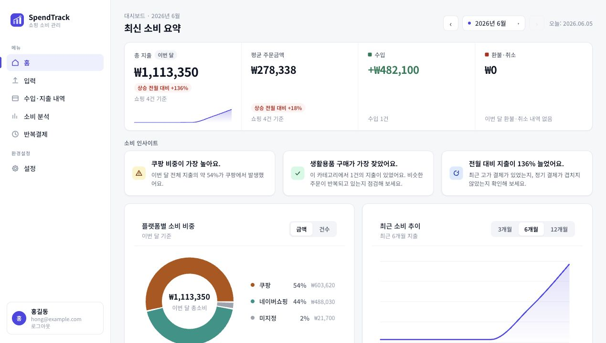
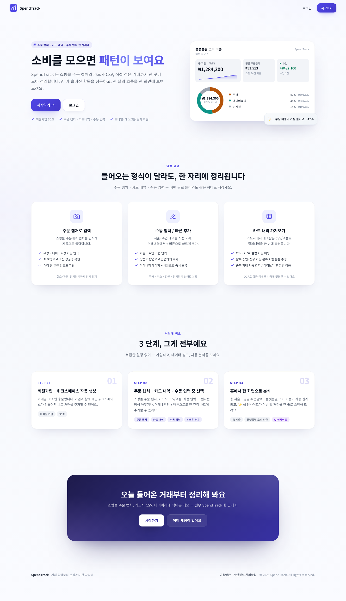
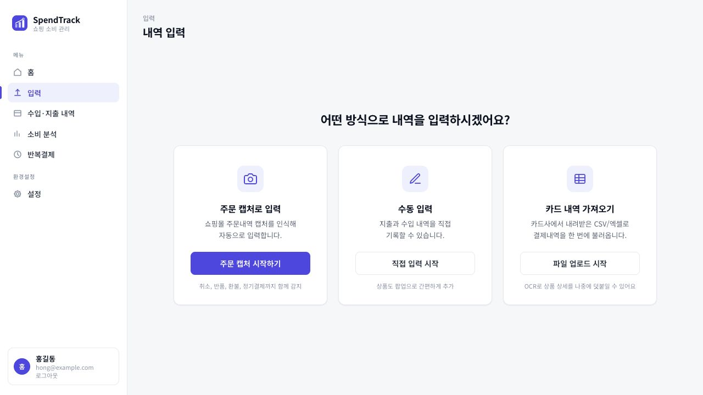
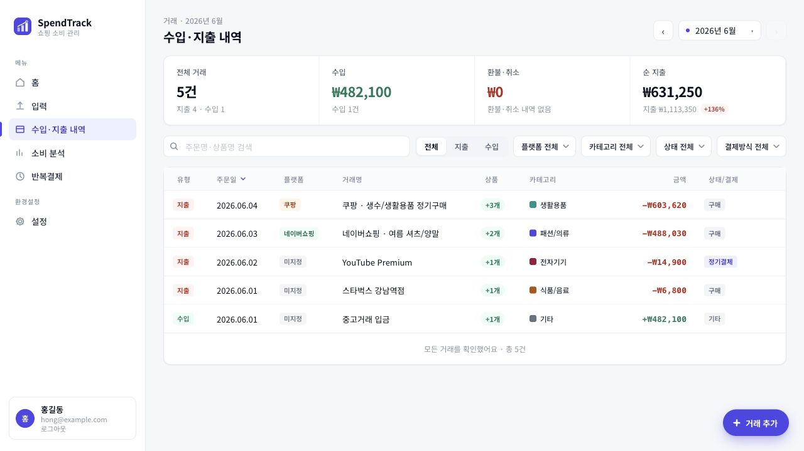
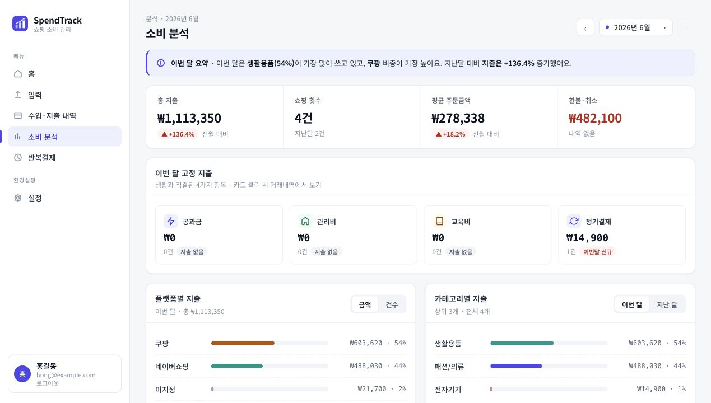
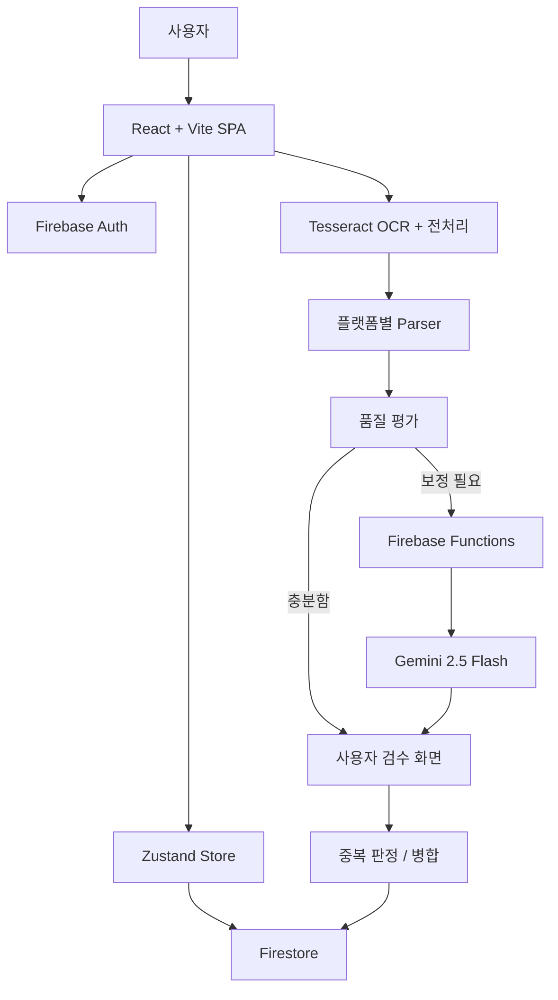
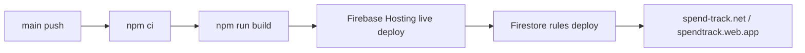

# SpendTrack

> 쇼핑몰 주문 캡처, 카드 명세서 CSV, 직접 입력을 한 곳에 모아  
> **카드 결제 한 줄을 실제 구매 상품 단위 소비 데이터로 풀어내는 소비 관리 서비스**

[](https://react.dev)
[](https://www.typescriptlang.org)
[](https://vite.dev)
[](https://firebase.google.com)



## 🧭 프로젝트 한눈에 보기

| 구분 | 내용 |
| --- | --- |
| 프로젝트 | KOSTA 2차 팀 프로젝트 |
| 팀 | Toos |
| 핵심 목표 | 카드 결제 단위 데이터를 상품 단위 소비 기록으로 재구성 |
| 주요 흐름 | 주문 캡처 업로드 -> OCR/AI 보정 -> 사용자 검수 -> 중복 병합 -> 분석 대시보드 |
| 배포 | Firebase Hosting + Cloudflare DNS |
| 검증 상태 | 2026-06-18 기준 운영 도메인 HTTP 200, production build 통과 |

## 🔗 주요 링크

| 구분 | 링크 |
| --- | --- |
| 운영 서비스 | https://spend-track.net |
| Firebase 배포 주소 | https://spendtrack.web.app |
| 최종 발표자료 | https://spendtrack.web.app/presentation.html |
| GitHub Repository | https://github.com/kosta-dev-sjh/p2-purchase-tracker |
| 샘플 파일 | [public/samples](public/samples) |

## 💡 왜 만들었나

온라인 쇼핑 결제 내역은 빠르게 쌓이지만, 카드 명세서에는 보통 `네이버페이 35,000원`, `쿠팡 128,400원`처럼 결제처와 총액만 남습니다. 실제로 어떤 상품을 샀는지, 일부 상품이 취소됐는지, 반복 결제인지 확인하려면 사용자가 쇼핑몰 주문 내역을 다시 찾아야 합니다.

SpendTrack은 이 문제를 **"결제 건을 기록하는 앱"이 아니라 "구매 상품 단위로 소비를 이해하는 앱"**으로 정의했습니다. 사용자는 주문 캡처나 카드 명세서를 올리고, 시스템이 만든 초안을 검수한 뒤, 월별 소비 흐름과 반복 지출을 확인할 수 있습니다.

## ✨ 핵심 기능

| 사용자 흐름 | 구현 내용 |
| --- | --- |
| 주문 캡처 분석 | 쿠팡·네이버쇼핑 주문 캡처에서 날짜, 상품명, 금액, 주문 상태를 추출합니다. |
| AI 보정 | OCR 품질이 낮은 상품 카드만 Gemini Vision 보정 경로로 보내 비용과 응답 지연을 줄입니다. |
| 카드 명세서 업로드 | CSV/XLSX 파일의 날짜, 금액, 결제처, 상태, 카테고리 헤더를 정규화합니다. |
| 직접 입력 | OCR/CSV로 잡히지 않는 지출을 상품 단위로 등록하고 필수값, 금액, 중복 여부를 확인합니다. |
| 중복 병합 | 수동 입력, OCR 저장, CSV 업로드에서 들어온 거래를 공통 기준으로 비교해 중복 저장을 줄입니다. |
| 소비 분석 | 월별 지출, 플랫폼 비중, 카테고리 지출, 반복 결제 후보, 주간 소비 패턴을 보여줍니다. |

## 🖼️ 화면 미리보기

| 랜딩 | 입력 방식 선택 |
| --- | --- |
|  |  |

| 거래 내역 | 소비 분석 |
| --- | --- |
|  |  |

## 🧭 사용자 흐름


## 🏗️ 시스템 구조



## 🛠️ 기술 스택과 선택 이유

| 영역 | 기술 | 선택 이유 |
| --- | --- | --- |
| Frontend | React 19, TypeScript, Vite 8 | 입력 화면이 많고 상태 분기가 복잡해 컴포넌트 단위로 화면을 나누고 타입으로 거래 구조를 고정했습니다. |
| Routing | React Router DOM 7 | 로그인 전 랜딩, 인증 화면, 보호 라우트를 한 SPA 안에서 분리했습니다. |
| State | Zustand | OCR 초안, 거래 목록, 사용자 프로필처럼 페이지를 오가는 상태를 가볍게 공유했습니다. |
| Styling | styled-components, design token | 대시보드와 입력 폼에서 색상, 간격, 카드 스타일을 일관되게 유지했습니다. |
| Chart | Recharts | 월별 추이, 플랫폼 비중, 카테고리 지출을 빠르게 시각화했습니다. |
| OCR | tesseract.js, canvas 전처리 | 쇼핑몰 캡처 이미지를 브라우저에서 먼저 분석해 AI 호출 전 기본 구조를 확보했습니다. |
| AI | Gemini 2.5 Flash, Firebase Functions proxy | API 키를 브라우저 번들에 넣지 않고 서버 함수의 secret으로 관리했습니다. |
| File parsing | SheetJS `xlsx`, CSV parser | 카드사 명세서의 CSV/XLSX 포맷을 모두 받을 수 있게 했습니다. |
| Infra | Firebase Hosting, Auth, Firestore, Functions | 인증, 사용자별 데이터 저장, 정적 배포, AI 프록시를 한 프로젝트에서 관리했습니다. |
| CI/CD | GitHub Actions | `main` 배포와 PR 미리보기 빌드를 Firebase Hosting 기준으로 자동화했습니다. |

## 🎯 주요 설계 판단

### OCR 결과를 바로 저장하지 않고 검수 화면을 둔 이유

OCR은 상품명 줄바꿈, 취소/반품 상태, 가격 누락에서 오인식이 생길 수 있습니다. 그래서 분석 결과를 곧바로 저장하지 않고 `OcrEdit` 화면에서 사용자가 상품 단위로 확인한 뒤 저장하게 했습니다. 자동화보다 데이터 신뢰도를 우선한 판단입니다.

### AI를 전체 이미지가 아니라 문제 상품에만 쓰는 이유

모든 캡처를 AI로 보내면 비용과 응답 시간이 커지고, API 장애가 곧바로 핵심 흐름 장애가 됩니다. SpendTrack은 `ocrQuality`, `ocrCorrection`, `ocrTruncation` 계층에서 먼저 보정하고, 그래도 불확실한 상품만 Gemini 보정 대상으로 보냅니다.

### 입력 경로는 나누고 저장 기준은 합친 이유

OCR, CSV, 직접 입력은 화면과 파싱 방식이 다르지만 최종적으로는 같은 거래 목록에 저장됩니다. 그래서 중복 판정은 `duplicateCheck.ts`, 데이터 보강은 `mergeEnrichment.ts`, 거래 상태 관리는 `transactionsStore.ts` 중심으로 모아 입력 경로가 늘어도 저장 기준이 흔들리지 않게 했습니다.

### 운영 키를 클라이언트에 두지 않은 이유

Gemini API 키는 Vite 환경 변수로 주입하지 않고 Firebase Functions secret(`GEMINI_API_KEY`)으로 관리합니다. 클라이언트는 callable function만 호출하고, Functions가 Gemini API 요청을 대신 보내 브라우저 번들에 키가 노출되는 위험을 줄였습니다.

## 📁 프로젝트 구조

```text
src/
  App.tsx                         # 라우팅, 인증 보호 라우트
  components/                     # 공통 UI, 레이아웃, 모달, 온보딩
  constants/                      # 라벨, 입력 제한, 카테고리 기준
  data/                           # 카테고리 concept dictionary
  lib/                            # Firebase 초기화, sync, repository
  pages/
    Landing/                      # 비로그인 랜딩
    Home/                         # 월간 요약
    Upload/                       # 입력 방식 선택
    OcrUpload/                    # 이미지 업로드 및 OCR 분석
    OcrEdit/                      # OCR 결과 검수/수정/저장
    CsvUpload/                    # 카드 CSV/XLSX 업로드
    ManualEntry/                  # 수동 입력
    Transactions/                 # 거래 목록, 필터, 상세, 수정
    Analysis/                     # 소비 분석
    Subscriptions/                # 반복결제 후보
    Settings/                     # 프로필/카테고리/계정 관리
  stores/                         # Zustand store
  utils/                          # OCR, CSV, 중복, 카테고리, 정규화 로직

functions/
  src/index.ts                    # Gemini proxy, 계정 삭제 유예, 닉네임 변경 제한

public/
  presentation.html               # 최종 발표자료
  samples/                        # CSV/XLSX 업로드 검증용 샘플 데이터
```

## 🗺️ 라우트 맵

| Route | 설명 |
| --- | --- |
| `/` | 로그인 상태면 홈, 비로그인이면 랜딩 |
| `/login`, `/register`, `/forgot-password` | 인증 화면 |
| `/upload` | 입력 방식 선택 |
| `/ocr-upload` | 주문 캡처 업로드 |
| `/ocr-edit` | OCR 결과 편집 및 저장 |
| `/csv-upload` | 카드 명세서 CSV/XLSX 업로드 |
| `/manual-entry` | 직접 소비 입력 |
| `/transactions` | 거래 목록, 검색, 필터, 상세, 수정 |
| `/analysis` | 월간 소비 분석 |
| `/subscriptions` | 반복결제 관리 |
| `/settings` | 프로필, 카테고리, 계정 설정 |
| `/terms`, `/privacy` | 약관, 개인정보 처리방침 |

## 🔧 문제 해결 기록

| 문제 | 원인/시도 | 해결 |
| --- | --- | --- |
| 첫 방문 사용자가 `/`에서 바로 로그인 화면으로 이동 | 루트 라우트가 보호 라우트처럼 동작해 서비스 설명을 보기 전에 인증 흐름으로 넘어감 | 로그인 흔적이 없으면 랜딩을 즉시 보여주고, 저장된 Firebase Auth 토큰이 있을 때만 세션 확인 화면을 노출 |
| 주문 캡처 OCR 결과의 상품명·가격 일부 누락 | 쇼핑몰 캡처의 긴 상품명, 작은 가격 텍스트, 취소/반품 문구가 OCR 신뢰도를 낮춤 | 플랫폼 감지, 상품별 품질 평가, 상품명 잘림 보정, AI fallback을 단계적으로 적용 |
| 카드 CSV/XLSX의 카드사별 헤더 차이 | 파일마다 날짜, 금액, 결제처, 승인 상태 컬럼명이 달라 단일 parser로 처리하기 어려움 | 헤더 정규화와 샘플 파일을 두고, 자동 매핑이 실패한 행은 보정 경로로 분리 |
| Gemini API 키 노출 위험 | 프론트엔드 환경 변수에 키를 넣으면 빌드 산출물에서 노출될 수 있음 | Firebase Functions callable proxy와 secret 기반 키 관리를 적용 |

## 🚢 배포와 CI/CD



- `main` 브랜치 push 시 Firebase Hosting live 채널로 배포합니다.
- PR 생성/갱신 시 Firebase Hosting preview 채널을 7일 만료 URL로 생성합니다.
- `firebase.json`에서 SPA fallback과 정적 자산 캐시 헤더를 설정했습니다.
- Functions 배포는 `functions/package.json`의 별도 스크립트로 분리되어 있습니다.

## ✅ 검증한 항목

| 항목 | 확인 내용 |
| --- | --- |
| 운영 도메인 | 2026-06-18 기준 `https://spend-track.net` HTTP 200 응답 확인 |
| Production build | 2026-06-18 기준 `npm run build` 통과 |
| 화면 자산 | README에 사용하는 랜딩, 홈, 입력, 거래, 분석 스크린샷 파일 존재 확인 |
| 샘플 데이터 | CSV/XLSX 업로드 검증용 샘플 파일 제공 |
| CI 설정 | Firebase Hosting live 배포와 PR preview workflow 존재 확인 |
| 보안 구조 | Gemini API 키를 Functions secret으로 읽는 callable proxy 구조 확인 |

## 🚀 로컬 실행

```bash
npm install
npm run dev
```

```bash
npm run build      # TypeScript + Vite production build
npm run analyze    # dist/bundle-stats.html 생성
npm run lint       # ESLint
```

Node.js는 `package.json` 기준 `20.19+` 또는 `22.12+`가 필요합니다. Firebase와 Gemini 연동 값은 `.env.local`과 Firebase secret으로 관리하며, `.env*` 파일과 API 키는 커밋하지 않습니다.

## 👥 팀과 역할

| 이름 | 역할 |
| --- | --- |
| 송정현 | Lead, 서비스 구조, OCR/AI 파이프라인, Firebase 배포, README/포트폴리오 정리 |
| 이효도 | QA, 사용자 시나리오 검증, 발표 흐름 점검 |

개발 과정에서 Claude, Cowork, Claude Design, Codex를 요구사항 정리, UI 개선, OCR 예외 케이스 정리, 문서화 보조 도구로 활용했습니다.

## 🧩 회고와 다음 개선

### 좋았던 점

- 결제 내역을 상품 단위로 풀어내는 문제를 잡으면서 일반 가계부와 다른 사용 시나리오를 만들 수 있었습니다.
- OCR, CSV, 직접 입력을 모두 받되 최종 저장 기준을 통일해 데이터 품질을 관리했습니다.
- AI 호출을 품질 게이트 뒤에 배치해 비용과 장애 영향을 줄이는 구조를 실험했습니다.

### 아쉬운 점

- 쇼핑몰 캡처 UI가 바뀌면 parser 보정이 추가로 필요합니다.
- 카드사별 CSV/XLSX 포맷을 더 많이 확보하면 자동 매핑 신뢰도를 높일 수 있습니다.
- 현재 README에는 수동 QA 중심 검증이 많아, 핵심 유틸 단위 테스트를 더 보강할 여지가 있습니다.

### 다음 개선 후보

- OCR parser와 중복 판정 유틸의 단위 테스트 추가
- 카드사 샘플 포맷 확대
- 반복결제 후보 탐지 기준 고도화
- 모바일 업로드 플로우 QA 보강
