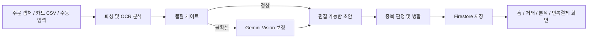
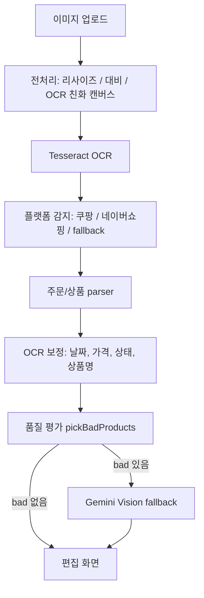
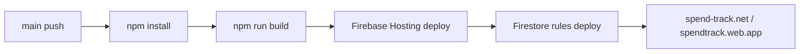

# SpendTrack

> 쇼핑몰 주문 캡처, 카드 명세서 CSV, 직접 입력을 한 곳에 모아  
> **카드 결제 한 줄을 실제 구매 상품 단위 소비 데이터로 풀어내는 소비 관리 서비스**

[](https://react.dev)
[](https://www.typescriptlang.org)
[](https://vite.dev)
[](https://firebase.google.com)

| 구분 | 링크 |
| --- | --- |
| 운영 사이트 | https://spend-track.net |
| Firebase 배포 주소 | https://spendtrack.web.app |
| 발표자료 | https://spendtrack.web.app/presentation.html |
| GitHub Repository | https://github.com/kosta-dev-sjh/p2-purchase-tracker |
| 팀 | Toos / KOSTA 2차 프로젝트 |


## 1. 왜 만들었나

온라인 결제는 빠르지만 기록은 흩어집니다. 카드 명세서에는 `네이버페이 35,000원`, `쿠팡 128,400원`처럼 결제처와 총액만 남고, 실제로 산 상품·배송 상태·취소 항목·반복 결제 여부는 사용자가 다시 찾아야 합니다.

SpendTrack은 이 문제를 **"결제 건"이 아니라 "구매 상품"을 기준으로 소비를 기록하는 문제**로 정의했습니다. 사용자는 주문 화면 캡처나 카드 CSV를 올리고, OCR/AI가 만든 초안을 확인한 뒤, 한 달 소비 패턴을 대시보드에서 확인합니다.

## 2. 채용 관점 핵심 요약

| 평가 포인트 | 구현 내용 |
| --- | --- |
| 문제 정의 | 카드 명세서의 결제 단위를 상품 단위 소비 데이터로 재구성 |
| 사용자 경험 | 업로드 → OCR 분석 → 수정/중복 확인 → 저장 → 분석 대시보드 |
| 기술 난이도 | OCR 전처리, 플랫폼 감지, 품질 게이트, AI 보정, CSV/XLSX 파싱, 중복 병합 |
| 운영 경험 | Firebase Hosting, Auth, Firestore, Functions, GitHub Actions 자동 배포 |
| 보안 의식 | Gemini API 키를 프론트 번들에 노출하지 않고 Firebase Functions secret으로 관리 |
| 유지보수성 | 입력 경로별 로직을 분리하면서도 거래 저장/중복 판정 기준은 공통 유틸로 일원화 |

## 3. 주요 기능

### OCR 주문 캡처 분석

- 쿠팡·네이버쇼핑 주문 캡처를 업로드하면 날짜, 상품명, 금액, 주문 상태를 추출합니다.
- `tesseract.js` 기반 1차 OCR 이후, 품질이 낮은 카드만 Gemini Vision 보정 대상으로 보냅니다.
- 긴 상품명 잘림, 가격 누락, 취소/반품 상태 오인식 같은 케이스를 `ocrQuality`, `ocrCorrection`, `ocrTruncation` 계층에서 보정합니다.

### 카드 명세서 CSV/XLSX 업로드

- 카드사 거래내역을 CSV 또는 XLSX로 업로드해 한 달치 소비를 빠르게 반영합니다.
- 날짜, 금액, 결제처, 상태, 카테고리 헤더를 정규화해 다양한 파일 포맷을 처리합니다.
- 이미 저장된 거래와 충돌하면 exact duplicate / item diff를 나누어 병합 또는 건너뛰기를 지원합니다.

### 수동 입력과 빠른 추가

- OCR/CSV로 잡히지 않는 현금성 지출이나 직접 입력 항목을 상품 단위로 등록합니다.
- 필수값 검증, 오류 필드 포커스 이동, 중복 경고를 통해 입력 실수를 줄입니다.

### 소비 분석 대시보드

- 월별 총 지출, 수입, 평균 주문 금액, 플랫폼별 소비 비중을 보여줍니다.
- 카테고리별 지출, 반복 결제 후보, 주간 소비 패턴을 계산합니다.
- 넷플릭스, 유튜브 프리미엄, 통신 자동납부처럼 반복성이 높은 항목은 정기결제 흐름으로 분리합니다.

### 사용자 계정과 동기화

- Firebase Auth로 로그인/회원가입/비밀번호 재설정을 처리합니다.
- Firestore에 사용자별 거래, 카테고리, 프로필, AI 인사이트 캐시를 분리 저장합니다.
- 로컬 상태와 Firestore 동기화를 분리해 오프라인성 UX와 원격 저장을 함께 고려했습니다.

## 4. 서비스 화면


첫 화면은 "소비를 모으면 패턴이 보여요"라는 제품 메시지와 함께 입력 방식, 사용 단계, CTA, footer까지 이어지는 랜딩 흐름을 보여줍니다. README에서 스크린샷을 바로 노출한 이유는, 채용 담당자가 저장소에 들어왔을 때 **실제 배포된 서비스의 완성도**를 코드보다 먼저 확인할 수 있게 하기 위해서입니다.

## 5. 사용자 플로우



## 6. 기술 스택

| 영역 | 기술 |
| --- | --- |
| Frontend | React 19, TypeScript, Vite 8, React Router DOM |
| Styling | styled-components, design token 기반 색상/간격 관리 |
| State | Zustand, localStorage hydration, Firebase sync |
| Chart | Recharts |
| OCR | tesseract.js, 이미지 전처리, 플랫폼별 parser |
| AI | Gemini 2.5 Flash via Firebase Functions proxy |
| File parsing | SheetJS `xlsx`, CSV parser |
| Backend / Infra | Firebase Auth, Firestore, Functions, Hosting |
| CI/CD | GitHub Actions → Firebase Hosting production deploy + PR preview |

## 7. 구현 깊이

### OCR 파이프라인



핵심은 AI를 무조건 호출하지 않는 것입니다. OCR 결과가 충분히 구조화되면 그대로 편집 화면으로 보내고, 가격 누락·날짜 결측·상품명 신뢰도 저하처럼 사용자가 직접 고치기 어려운 카드만 AI 보정 경로로 보냅니다. 이 구조는 비용, 응답 시간, API 장애 리스크를 함께 낮춥니다.

### 중복 판정과 병합

수동 입력, OCR 저장, CSV 업로드, 거래 수정은 모두 다른 화면에서 들어오지만 최종 데이터는 하나의 거래 목록입니다. 그래서 중복 판정은 `duplicateCheck.ts`, 데이터 보강은 `mergeEnrichment.ts`, 거래 CRUD는 `transactionsStore.ts`로 모았습니다.

중복은 단순히 "같은 날짜 + 같은 금액"으로만 처리하지 않고, 결제처/상품명/상태 차이를 비교해 다음처럼 나눕니다.

- **Exact duplicate**: 같은 거래로 보고 저장을 건너뜀
- **Item diff**: 기존 거래에 없는 상품 정보가 있으면 병합 후보로 제안
- **Manual review**: 자동 판단이 위험하면 사용자가 확인

### 보안과 운영

Gemini API 키는 프론트엔드 환경 변수로 넣지 않습니다. 클라이언트는 Firebase callable function만 호출하고, Functions가 secret(`GEMINI_API_KEY`)을 읽어 Gemini API로 프록시합니다. 이 구조로 브라우저 번들에 키가 노출되는 문제를 피했습니다.

Firebase Hosting은 `dist`를 배포하고, Vite의 `public` 폴더에 둔 `presentation.html`도 함께 복사됩니다. 그래서 발표자료는 별도 서버 없이 `/presentation.html`로 바로 열립니다.

## 8. 프로젝트 구조

```text
src/
  App.tsx                         # 라우팅, 인증 보호 라우트
  components/                     # 공통 UI, 레이아웃, 모달, 온보딩
  constants/                      # 라벨, 입력 제한, 카테고리 기준
  data/                           # 카테고리 concept dictionary
  lib/                            # Firebase 초기화, sync, repository
  pages/
    Landing/                      # 비로그인 랜딩
    Home/                         # 월간 요약
    OcrUpload/                    # 이미지 업로드 및 OCR 분석
    OcrEdit/                      # OCR 결과 검수/수정/저장
    CsvUpload/                    # 카드 CSV/XLSX 업로드
    ManualEntry/                  # 수동 입력
    Transactions/                 # 거래 목록, 필터, 상세, 수정
    Analysis/                     # 소비 분석
    Subscriptions/                # 반복결제 후보
    Settings/                     # 프로필/카테고리/계정 관리
  stores/                         # Zustand store
  utils/                          # OCR, CSV, 중복, 카테고리, 정규화 로직

functions/
  src/index.ts                    # Firebase Functions, Gemini proxy, account safety

public/
  presentation.html               # 최종 발표자료, 배포 후 /presentation.html
  samples/                        # CSV/XLSX 샘플 파일
```

## 9. 라우트 맵

| Route | 설명 |
| --- | --- |
| `/` | 로그인 상태면 홈, 비로그인이면 랜딩 |
| `/login`, `/register`, `/forgot-password` | 인증 화면 |
| `/upload` | 업로드 방식 선택 |
| `/ocr-upload` | 주문 캡처 업로드 |
| `/ocr-edit` | OCR 결과 편집 및 저장 |
| `/csv-upload` | 카드 명세서 CSV/XLSX 업로드 |
| `/manual-entry` | 수동 소비 입력 |
| `/transactions` | 거래 목록/검색/필터/상세/수정 |
| `/analysis` | 월간 소비 분석 |
| `/subscriptions` | 반복결제 관리 |
| `/settings` | 프로필, 카테고리, 계정 설정 |
| `/terms`, `/privacy` | 약관/개인정보 처리방침 |

## 10. 실행 방법

```bash
# Node.js 20.19+ 또는 22.12+ 필요
npm install
npm run dev
```

```bash
npm run build      # TypeScript + Vite production build
npm run analyze    # dist/bundle-stats.html 생성
npm run lint       # ESLint
```

환경 변수는 `.env.local`에만 작성합니다. `.env*` 파일과 API 키는 커밋하지 않습니다.

## 11. 배포와 CI/CD

`main`에 push되면 GitHub Actions가 다음 순서로 배포합니다.



PR은 Firebase Hosting preview workflow로 임시 URL을 생성하도록 구성되어 있습니다.

## 12. 검증한 항목

- TypeScript production build 통과
- Vite build 산출물 생성
- Firebase Hosting 배포 확인
- `/presentation.html` 정적 파일 접근 확인
- 데스크톱/모바일 랜딩 화면 캡처 확인

## 13. 팀과 역할

| 이름 | 역할 |
| --- | --- |
| 송정현 | Lead, 서비스 구조, OCR/AI 파이프라인, Firebase 배포, README/포트폴리오 정리 |
| 이효도 | QA, 사용자 시나리오 검증, 발표 흐름 점검 |

개발 과정에서 Claude, Cowork, Claude Design, Codex를 AI 협업 도구로 활용했습니다. 단순 코드 생성이 아니라 요구사항 정리, UI 개선, OCR 예외 케이스 정리, README 문서화에 보조 도구로 사용했습니다.

## 14. 산출물

| 구분 | 링크 | 설명 |
| --- | --- | --- |
| 운영 서비스 | https://spend-track.net | Cloudflare DNS를 연결한 실제 서비스 도메인 |
| Firebase 배포 주소 | https://spendtrack.web.app | Firebase Hosting 기본 배포 주소 |
| 최종 발표자료 | https://spendtrack.web.app/presentation.html | `public/presentation.html`이 배포된 공개 발표자료 |
| GitHub Repository | https://github.com/kosta-dev-sjh/p2-purchase-tracker | 소스 코드, README, 샘플 파일, 배포 설정 |
| 샘플 파일 | [public/samples](public/samples) | CSV/XLSX 업로드 검증용 샘플 데이터 |

발표자료는 Vite `public` 폴더에 포함되어 CI/CD 배포 시 자동으로 `dist/presentation.html`로 복사됩니다.
